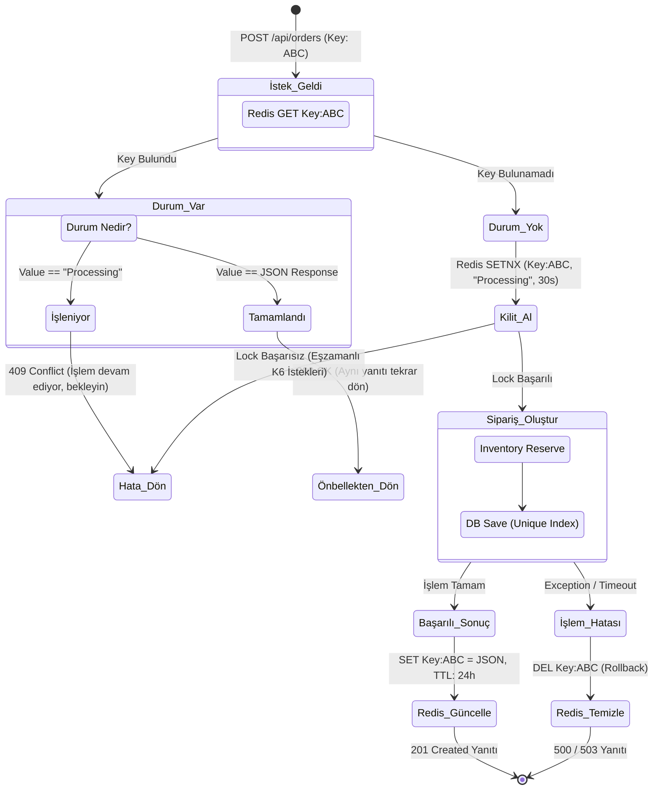
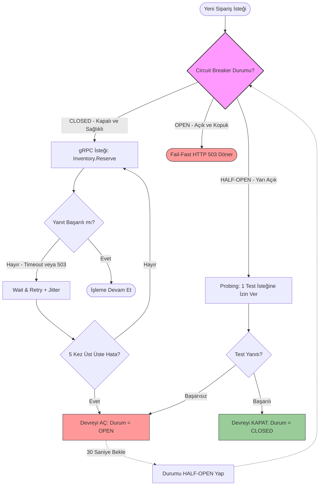
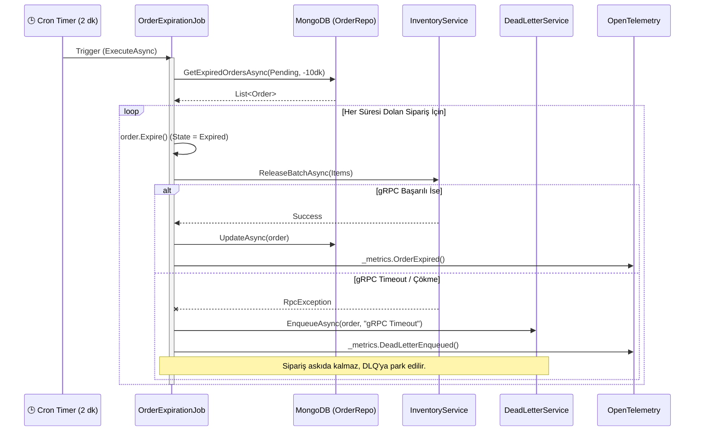

<div align="center">

# 🚀 ShopSync: Kurumsal Seviye Mikroservis Mimarisi, DDD ve Yüksek Yük Testi (K6) Referans Kılavuzu
**Saniyede Binlerce İsteğe Dayanan, Dağıtık, Hata Toleranslı (Resilient), Çoklu Depo Destekli ve Tam Gözlemlenebilir E-Ticaret Arka Uç (Backend) Sistemi**

<p align="center">
  
  
  
  
  
  
  
  
  
  
  
  
  
</p>

---
**ShopSync**, sıradan bir CRUD uygulamasının çok ötesinde, modern ve bulut-yerel (cloud-native) sistemlerin karşılaştığı **Dağıtık Sistem Yanılgıları (Fallacies of Distributed Computing)** problemlerini çözmek için inşa edilmiştir. Bu proje, **Domain-Driven Design (DDD)** prensipleri etrafında şekillenmiş, dış dünya ile bağını **gRPC** ve **REST** üzerinden kuran, **K6** ile yapılan acımasız stres testlerine (Stress Testing) dayanacak şekilde Polly ile zırhlandırılmış devasa bir mühendislik çalışmasıdır.

Bu mimari başyapıt, **Rasyonet** firmasında **Software Developer Intern (Yazılım Geliştirici Stajyer)** olarak görev alırken tasarlayıp geliştirdiğim 2. büyük projedir. (1. Staj Projemi incelemek için: [MoneyTransferCenter](https://github.com/barandasdemir0/MoneyTransferCenter))

</div>

---

## 📑 Dev Kılavuz: İçindekiler
1. [Projenin Varoluş Felsefesi ve Dağıtık Sistemler](#1-projenin-varoluş-felsefesi-ve-dağıtık-sistemler)
2. [Domain-Driven Design (DDD) Derinlemesine Analizi](#2-domain-driven-design-ddd-derinlemesine-analizi)
3. [ShopSync.OrderService Mimarisi ve Repository Deseni](#3-shopsyncorderservice-mimarisi-ve-repository-deseni)
4. [ShopSync.InventoryService: Çoklu Depo (Multi-Warehouse) ve Gelişmiş gRPC Özellikleri](#4-shopsyncinventoryservice-çoklu-depo-multi-warehouse-ve-gelişmiş-grpc-özellikleri)
5. [Veri Kalıcılığı (Persistence): Neden MongoDB Replica Set?](#5-veri-kalıcılığı-persistence-neden-mongodb-replica-set)
6. [Mükerrer İşlemlere Karşı Kesin Çözüm: Idempotency](#6-mükerrer-i̇şlemlere-karşı-kesin-çözüm-idempotency)
7. [Polly ile Hata Toleransı: Zincirleme Çöküşleri (Cascading Failures) Engellemek](#7-polly-ile-hata-toleransı-zincirleme-çöküşleri-cascading-failures-engellemek)
8. [Arka Plan İşçileri (Background Workers) ve DLQ](#8-arka-plan-i̇şçileri-background-workers-ve-dlq)
9. [OpenTelemetry ile Tam Kapsamlı Gözlemlenebilirlik](#9-opentelemetry-ile-tam-kapsamlı-gözlemlenebilirlik)
10. [K6 ile Performans ve Stres Testi Stratejisi (Core)](#10-k6-ile-performans-ve-stres-testi-stratejisi-core)
11. [Kod Analizi: Background Jobs ve DLQ İşleyişi](#11-kod-analizi-background-jobs-ve-dlq-i̇şleyişi)
12. [Kod Analizi: Altyapı ve Docker Compose](#12-kod-analizi-altyapı-ve-docker-compose)
13. [Geliştirici Ortamı Kurulumu ve Operasyonel Runbook](#13-geliştirici-ortamı-kurulumu-ve-operasyonel-runbook)

---

## 1. Projenin Varoluş Felsefesi ve Dağıtık Sistemler

Geleneksel monolitik (tek parça) sistemler, e-ticaret gibi anlık trafiğin çok dalgalı (spiky) olduğu alanlarda sınıfta kalırlar. ShopSync, sistemi Bounded Context (Sınırlandırılmış Bağlam) kurallarına göre **Sipariş** ve **Envanter** olarak tamamen ayırır.

### 1.1 Dağıtık Sistem Yanılgıları (Fallacies of Distributed Computing)
Geliştiricilerin genellikle unuttuğu ve ShopSync'in özellikle ele aldığı dağıtık sistem kuralları:
1. **Ağ güvenilirdir:** Hayır, değildir. Paketler kaybolur, switchler bozulur. Bu yüzden `Polly` eklendi.
2. **Gecikme (Latency) sıfırdır:** Hayır, değildir. İç iletişimde JSON parsing maliyetinden kaçınmak için `gRPC (Protobuf)` kullanıldı.
3. **Bant genişliği (Bandwidth) sonsuzdur:** Hayır, değildir. Mesaj boyutlarını küçültmek için gereksiz field'lar gönderilmez.
4. **Ağ güvenlidir:** Hayır, değildir. İç ağ izole edilmiştir.
5. **Topoloji değişmez:** Hayır, değişir. Kubernetes veya Docker Swarm ortamında podlar sürekli kapanıp açılabilir, IP'ler değişir.

### 1.2 İletişim Stratejisi: REST ve gRPC Birlikteliği
- İstemciler (Scalar, Postman, UI vb.) doğrudan Order API'ye REST (HTTP/1.1) ile konuşur.
- Order Service içeri döndüğünde, veriyi JSON'dan Protobuf (Binary) formatına çevirir ve Inventory Service ile HTTP/2 Multiplexing destekli **gRPC** üzerinden konuşur. Bu mimari "Backend for Frontend" (BFF) konseptine benzer bir işlevi Backend seviyesinde uygular.

---

## 2. Domain-Driven Design (DDD) Derinlemesine Analizi

Piyasadaki birçok proje MVC (Model-View-Controller) veya Anemic Domain Model kullanır. Nesnelerin sadece `get; set;` property'leri vardır ve bütün iş mantığı Service sınıflarına yayılmıştır. ShopSync ise gerçek bir **DDD (Domain-Driven Design)** kalesidir.

### 2.1 Aggregate Root ve Zengin Modeller (Rich Domain Model)
`Order.cs` sınıfı sıradan bir veritabanı tablosu temsili değildir, o bir **Aggregate Root**'tur (Kök Nesne). Kendi içindeki kuralları dış dünyaya kapatmıştır.
- `public string Status { get; private set; }` şeklindeki tanımlarla, dışarıdan kimse durumu rastgele güncelleyemez.
- `Confirm()`, `Cancel()`, `Expire()` metotları ile durum (State) değişiklikleri yönetilir.

**Gerçek Kod Kesiti (Order.cs içinden):**
```csharp
// Siparişi onayla: Pending → Confirmed
// Sadece Pending durumundaki siparişler onaylanabilir
public void Confirm()
{
    if (CurrentStatus != OrderStatus.Pending)
    {
        throw new DomainException(
           $"Sadece bekleyen siparişler onaylanabilir. Mevcut durum: {Status}",
           "ORDER_INVALID_STATE_TRANSITION");
    }
       
    Status = OrderStatus.Confirmed.Code;
    History.Add(new OrderHistory(OrderStatus.Confirmed, "Sipariş onaylandı"));
    Touch();
}
```
Gördüğünüz gibi, nesnenin durumunu `Pending` olmayan bir durumda onaylamaya kalkarsanız (örneğin daha önce iptal edilmiş bir sipariş), nesne kendi bütünlüğünü korur ve anında `DomainException` fırlatır. Nesne her durum değiştirdiğinde `History` (Geçmiş) listesine yeni bir kayıt atarak "Audit Trail" (Denetim İzi) ve Event Sourcing mantığına zemin hazırlar.

### 2.2 Global Exception Handling ve Domain İstisnaları
Domain katmanında fırlatılan `DomainException` hataları, Controller veya Service katmanlarında `try-catch` blokları ile çirkinleştirilmez. Uygulamanın en tepesinde duran `GlobalExceptionHandler` (bir .NET 10 IExceptionHandler implementasyonu) bu hataları yakalar, `ProblemDetails` standartlarına dönüştürür ve HTTP 400 (Bad Request) veya HTTP 409 (Conflict) olarak istemciye döner. 

---

## 3. ShopSync.OrderService Mimarisi ve Repository Deseni

Sipariş yönetimi, dışarıdan HTTP isteklerini alıp bunları Domain iş kurallarına göre işleyen ve veritabanına aktaran devasa bir orkestrasyondur.

### 3.1 Katmanların Soyutlanması (Clean Architecture Esintileri)
- **Controllers Katmanı:** İstekleri alır ve manuel inline validasyon kurallarıyla (örn: `if (request.Items.Count == 0) return BadRequest()`) gelen JSON verisini denetler. Harici doğrulama kütüphanelerine (örn. FluentValidation) bel bağlamak yerine, hafif, yüksek performanslı ve doğrudan controller seviyesinde kararlar alınır.
- **DTOs ve Mapster (Yüksek Performanslı Eşleme):** Domain modelleri (Aggregate Roots) dışarıya doğrudan açılmaz (Encapsulation). Entity-DTO dönüşümleri için hantal AutoMapper yerine, CPU döngülerinden tasarruf sağlayan yüksek performanslı **Mapster** kütüphanesi kullanılmıştır.
- **Services Katmanı:** Redis Idempotency kilidini kontrol eden Middleware'in ardından, Domain Aggregate'i (`Order.cs`) yaratır ve gRPC istemcisini tetikler.
- **Repositories Katmanı:** Data Access Logic (Veri Erişim Mantığı) burada gizlidir. Servis katmanı MongoDB kodlarını görmez. `IOrderRepository` arayüzü sayesinde bağımlılıklar tersine çevrilmiştir (Dependency Inversion).

### 3.2 Repository Deseni'nin Genişletilmesi
`IOrderRepository` sadece basit bir CRUD arayüzü değildir. İş mantığını ve Analitiği destekleyen özel metotlara sahiptir:

**Gerçek Kod Kesiti (IOrderRepository.cs):**
```csharp
public interface IOrderRepository
{
    // Temel CRUD
    Task InsertAsync(Order order, CancellationToken ct = default);
    Task UpdateAsync(Order order, CancellationToken ct = default);
    Task<Order?> GetByOrderIdAsync(string orderId, CancellationToken ct = default);

    // Background Jobs için özel sorgular
    Task<List<Order>> GetExpiredOrdersAsync(DateTime olderThan, CancellationToken ct = default);
    Task<List<Order>> GetOrdersByStatusBeforeDateAsync(string status, DateTime cutoffTime, CancellationToken ct = default);

    // Analitik (Analytics) ve Dashboard için özel sorgular
    Task<long> CountByStatusAsync(string status, DateTime? from = null, DateTime? to = null, CancellationToken ct = default);
    Task<double> GetAverageTransitionTimeAsync(string targetStatus, DateTime? from = null, DateTime? to = null, CancellationToken ct = default);
}
```

### 3.3 Sipariş Analitiği, Peak Tespitleri ve Zaman Geçişleri
Sistem, sadece siparişleri kaydetmenin ötesinde e-ticaret siteleri için hayati olan istatistiksel verileri sunmak üzere `GetAnalytics` endpoint'ini barındırır:
- **Zaman Geçişleri (Transition Times):** Bir siparişin *Pending* (Beklemede) durumundan *Confirmed* (Onaylandı) durumuna geçmesinin ortalama ne kadar sürdüğünü (`GetAverageTransitionTimeAsync`) milisaniye cinsinden hesaplar.
- **Peak (Zirve) Zaman Tespiti:** Hangi tarih aralıklarında (saat, gün) siparişlerin tavan yaptığını (peak), Black Friday veya anlık kampanyalarda sistemin hangi hızda tüketim yaptığını ölçerek operasyonel öngörü sağlar.

### 3.4 Kapsamlı Sistem Mimarisi Şeması (Mermaid)

Tüm bu katmanların (Order, Inventory, Redis, Mongo, Otel, K6) birbirleriyle nasıl etkileşime girdiğini gösteren yapı aşağıdadır:

```mermaid
graph TD
    %% İstek Girişi
    Client(["💻 Yük Testi K6 / İstemci - REST API"]) 

    %% Mikroservisler ve İş Katmanı
    subgraph "ShopSync Core Backend (DDD & Mikroservis Ağı)"
        
        Client -->|HTTP POST /api/orders - Saniyede 500+ İstek| OrderControllers
        Client -->|HTTP GET /api/inventory/forecast| InventoryProxy
        
        subgraph "📦 Order Service (DDD Bounded Context)"
            OrderControllers["Controllers<br/>Manual Check"]
            InventoryProxy["InventoryController<br/>gRPC Proxy"]
            IdempotencyMiddleware("Idempotency Katmanı<br/>Redis SETNX")
            OrderServices["Domain Services<br/>Orchestration"]
            OrderAggregate(("Order<br/>Aggregate Root"))
            OrderRepo["IOrderRepository<br/>MongoDB"]
            OrderGrpcClient["gRPC Client + Polly Resilience"]
            
            OrderControllers --> IdempotencyMiddleware
            IdempotencyMiddleware --> OrderServices
            OrderServices --> OrderAggregate
            OrderServices --> OrderGrpcClient
            OrderServices --> OrderRepo
            InventoryProxy --> OrderGrpcClient
        end
        
        subgraph "🏭 Inventory Service (gRPC Sunucusu)"
            InventoryGrpc["gRPC Services<br/>Port 5001<br/>Multi-Warehouse & Snapshots"]
        end
        
        subgraph "⏱ Background Workers (IHostedService)"
            OrderJobs["Order Expiration Job<br/>DLQ Handler"]
            InventoryJobs["Inventory Release / Reconciliation"]
        end

        OrderGrpcClient -.->|gRPC / HTTP2 Düşük Gecikme| InventoryGrpc
        OrderJobs -.->|ReleaseBatchAsync| InventoryGrpc
        
        %% Veri Katmanı
        subgraph "💾 Veri Katmanı (Data Access)"
            Redis[("Redis 7.2<br/>Distributed Lock")]
            OrderDB[("MongoDB: Order_DB<br/>Replica Set")]
            InventoryDB[("MongoDB: Inventory_DB<br/>Replica Set")]
        end

        IdempotencyMiddleware <-->|Key Locks| Redis
        OrderRepo -->|Bson Serialization| OrderDB
        InventoryGrpc -->|Atomic Updates| InventoryDB
        OrderJobs <--> OrderDB
        
        %% Gözlemlenebilirlik (Observability)
        subgraph "🔍 Gözlemlenebilirlik (Observability Stack)"
            OtelCollector["OpenTelemetry Collector"]
            Prometheus["Prometheus<br/>Time-Series"]
            Loki["Grafana Loki<br/>Tags & Logs"]
            Jaeger["Jaeger<br/>Context Propagation"]
            GrafanaUI["Grafana Dashboards"]
            
            OtelCollector --> Prometheus
            OtelCollector --> Loki
            OtelCollector --> Jaeger
            
            Prometheus --> GrafanaUI
            Loki --> GrafanaUI
            Jaeger --> GrafanaUI
        end
        
        %% Telemetri Bağlantıları
        OrderControllers -.->|Custom Metrics Otel| OtelCollector
        OrderJobs -.->|ExpiryMetrics Otel| OtelCollector
        InventoryGrpc -.->|Otel Traces| OtelCollector
    end
    
    %% Stiller
    style OrderAggregate fill:#005571,stroke:#fff,stroke-width:3px,color:#fff
    style OrderRepo fill:#FF5733,stroke:#fff,stroke-width:2px,color:#fff
    style InventoryGrpc fill:#244C5A,stroke:#fff,stroke-width:2px,color:#fff
    style Redis fill:#DC382D,stroke:#fff,stroke-width:2px,color:#fff
    style OrderDB fill:#4EA94B,stroke:#fff,stroke-width:2px,color:#fff
    style InventoryDB fill:#4EA94B,stroke:#fff,stroke-width:2px,color:#fff
    style GrafanaUI fill:#F46800,stroke:#fff,stroke-width:2px,color:#fff
```



---

## 4. ShopSync.InventoryService: Çoklu Depo (Multi-Warehouse) ve Gelişmiş gRPC Özellikleri

Inventory (Envanter) servisi dış dünyadan tamamen soyutlanmış, yalnızca iç ağdan (Internal Docker Network) ulaşılan bir servistir. Yakın zamanda yapılan eklemelerle bu servis bir "Enterprise ERP" sistemine dönüşmüştür.

### 4.1 Çoklu Depo (Warehouse) Yönetimi ve Rebalance
Sistem sadece stok miktarını tutmaz, ürünleri depolar (Warehouse Code) bazında ayırır.
- **Stock Rebalance (`RebalanceStockRequest`):** İki lokasyon (from_location -> to_location) arasında güvenli ve tutarlı (transactional) stok kaydırma imkanı sunar.
- **Yedek Depolara Yönlendirme (Fallback Mechanism):** `ReserveBatchWithFallback` gRPC endpoint'i sayesinde, müşteri sipariş verdiğinde eğer ana depo (`primary_warehouse`) boşalmışsa, sistem siparişi otomatik olarak yedek depolara (`fallback_warehouses`) kaydırarak satış kaçırmayı önler.

### 4.2 Snapshot (Anlık Görüntü) ve Point-in-Time Recovery
Envanter üzerinde yapılan yanlış veya test işlemlerine karşı **Snapshot** özelliği geliştirilmiştir.
- `CreateSnapshotRequest`: Tüm stokların mevcut o anki miktarını özel bir ID ile diske dondurur.
- `RestoreSnapshotRequest`: Bir sorun yaşanması halinde saniyeler içinde tüm envanter sayımını geriye sarmaya olanak tanır.

### 4.3 Yapay Zeka Hazırlığı ve Stok Tahminleme (Forecasting)
Geçmiş verilere dayanarak geleceği öngörmek, modern e-ticaretin belkemiğidir. `GetInventoryForecast` endpoint'i, istenilen gün sayısına (örn: 7 günlük) göre ürünün tahmini tükenme süresini (Out of Stock) veya ihtiyaç duyulan ek sipariş miktarını (Predicted Required Quantity) öngörmek üzere tasarlanmıştır. Bu yapı ileride eklenecek Machine Learning (Makine Öğrenimi) algoritmaları için bir altyapı oluşturur.

- **Atomic Operations ve Concurrency:** Eşzamanlı K6 testleri sırasında (saniyede 1000 istek) aynı stok bilgisini düşmeye çalışan istekleri engellemek için, MongoDB'nin `$inc` (Increment/Decrement) operatörlerini kullanarak veritabanı seviyesinde Optimistic Concurrency Control (İyimser Eşzamanlılık) sağlar. İki kişi tek kalan ürünü almaya çalışırsa, biri hata alır, diğeri alır.

---

## 5. Veri Kalıcılığı (Persistence): Neden MongoDB Replica Set?

E-ticarette sipariş geçmişi (`OrderHistory`), ürün kalemleri (`OrderLineItems`) ve sipariş ana gövdesi (Order) birbiriyle sımsıkı bağlıdır.

- **İlişkisel Veritabanı (RDBMS) Sorunu:** İlişkisel bir veritabanında bunları 3 ayrı tabloya bölüp `JOIN` ile çağırmak, sipariş okunurken ciddi I/O maliyeti yaratır. Ayrıca Aggregate Root mantığı tablolar arasında dağılmış olur.
- **Document DB (MongoDB) Çözümü:** ShopSync, MongoDB kullanarak tüm bir Sipariş Aggregate'ini tek bir BSON dokümanı olarak kaydeder.
- **Replica Set Zorunluluğu (`rs0`):** MongoDB, tekil düğümde (Standalone) Transactions (Çoklu işlem tutarlılığı) desteklemez. Sistemimiz Docker Compose üzerinden MongoDB'yi 1 düğümlü bir Replica Set olarak ayağa kaldırır. Bu sayede gerektiğinde çoklu doküman işlemlerinde tam ACID (Atomicity, Consistency, Isolation, Durability) garantisi sağlanır.

---

## 6. Mükerrer İşlemlere Karşı Kesin Çözüm: Idempotency

Sistem, yük testi (K6) altındayken aynı `Idempotency-Key` başlığıyla (Header) binlerce kez saldırıya uğrayabilir. Müşteri butona defalarca basmış olabilir veya mobil uygulama "Ağ Koptu" zannedip aynı JSON'u tekrar gönderebilir. Bu saldırılara karşı sistem 2 kalın duvar örer.

### 6.1 Redis Dağıtık Kiliti (Distributed Lock)
Bir istek geldiğinde, `IdempotencyKey` Guid'i Redis'te sorgulanır.
- Eğer yoksa, Redis `SETNX` (Set if Not Exists) komutuyla kilidi kapar (Değerini "Processing" yapar, 30 saniye TTL koyar).
- Aynı milisaniyede gelen ikinci istek `SETNX` komutundan `false` yanıtını alır ve sistem isteği HTTP 409 Conflict veya 423 Locked döndürerek hemen (Fail-Fast) düşürür. Bu en hızlı (Redis In-Memory) ve en maliyetsiz savunma hattıdır.

### 6.2 MongoDB Unique Index Garantisi (Race Condition Kalkanı)
Olası bir "Split-Brain" (Redis'in ikiye bölünmesi, cluster çökmesi) veya anlık Redis timeout'u durumunda kilitleme mekanizması atlansa bile veritabanı katmanı pes etmez.
`Order` tablosunda `idempotencyKey` sütununa **UNIQUE INDEX** basılmıştır. Veritabanı motoru (WiredTiger) aynı anahtarla gelen ikinci Insert işlemini diske yazmadan önce kontrol eder ve `MongoBulkWriteException: E11000 duplicate key error` hatası fırlatarak kesin olarak reddeder. Domain'in çifte sipariş alması İMKANSIZ hale getirilmiştir. Bu kurgu, "Eventual Consistency" değil **"Strong Consistency"** (Kesin Tutarlılık) yaklaşımıdır.

### 6.3 Idempotency State Machine (Durum Akış Şeması - Mermaid)

Mükerrer istek koruma kalkanının mantıksal (Logical) akış diyagramı:



---

## 7. Polly ile Hata Toleransı: Zincirleme Çöküşleri (Cascading Failures) Engellemek

Mikroservis sistemlerinde bir servisin çökmesi, ona bağlı tüm servisleri de yavaşlatıp çökertebilir. Buna "Cascading Failures" denir. Order Service, Inventory Service'e bağlanırken kendini korumak zorundadır.

### 7.1 Wait and Retry with Jitter (Geçici Hata Yönetimi)
Inventory Service anlık cevap vermezse (`StatusCode.Unavailable` veya `DeadlineExceeded`), sistem doğrudan hata dönmez. Exponential Backoff ile örn: 200ms, 400ms, 800ms tekrar dener. 
- *Neden Jitter?* Eğer herkes tam 400. milisaniyede tekrar istek atarsa (Buna "Thundering Herd" yani koşan sürünün ayak sesleri problemi denir) Inventory servisi henüz ayağa kalkamadan tekrar çöker. Polly konfigürasyonundaki `Jitter` (Rastgelelik) algoritması bu sürelere +23ms, -14ms gibi oynamalar katarak yükü mikrosaniyelere dağıtır ve sunucunun nefes almasını sağlar.

### 7.2 Circuit Breaker (Devre Kesici) Matematiği
Eğer Inventory Service tamamen çöktüyse (Konteyner down olduysa), ardışık 5 başarısız denemeden sonra Polly devreyi açar (Open State). 
- Sonraki 30 saniye boyunca içeri giren tüm yeni siparişler AĞA ÇIKMADAN "Fail-Fast" (Hızlı Hata) prensibiyle doğrudan reddedilir (`BrokenCircuitException`). 
- *Bunu Neden Yapıyoruz?* Aksi takdirde Order Service üzerinde on binlerce açık bağlantı (thread), TCP socketi ve RAM birikir. En sonunda Kestrel sunucusu "Connection Limit" veya CPU %100 kitlenmesi yaşayarak Order Service'in de çökmesine sebep olur.

### 7.3 Circuit Breaker Akış Şeması (Mermaid)



### 7.4 API Rate Limiting (Sabit Pencere ve Kuyruklama)
Dışarıdan gelen REST isteklerinin sistemi boğmasını (DDoS) veya hatalı istemcilerin (örn. sonsuz döngüye girmiş bir mobil uygulama) kaynakları tüketmesini engellemek için, .NET 10 yerleşik (built-in) Rate Limiter yapısı projeye dahil edilmiştir.
- **Fixed Window Limiter (Sabit Pencere):** Her IP adresi için belirli bir saniye (Window) aralığında maksimum istek sayısına (PermitLimit) izin verilir.
- **Kuyruklama (Queueing):** Limit aşıldığında istekler anında reddedilmek (HTTP 429) yerine önce küçük bir bekleme kuyruğa (QueueLimit) alınır ve `OldestFirst` mantığı ile sistem müsait oldukça eritilir.
- **Global Uygulama:** Bu koruma mekanizması, `Program.cs` içerisinde `PartitionedRateLimiter` kullanılarak `HttpContext` üzerinden IP adresi bazlı (partitioning) izole çalışır ve tüm API'yi sarmalar. Bekleme kuyruğu da dolduğunda standart bir JSON `TOO_MANY_REQUESTS` hata gövdesi (HTTP 429) ile yanıt verilir.

---

## 8. Arka Plan İşçileri (Background Workers) ve DLQ

Domain gereği, ödeme bekleyen siparişlerin (Pending) stoklarını sonsuza kadar rezerve edemeyiz. Bu "Eventual Consistency" (Nihai Tutarlılık) işlemlerini `.NET IHostedService` ile oluşturulan Background Worker'lar yönetir.

### 8.1 Expiration Job Mantığı
`OrderExpirationJob` her 2 dakikada bir uyanır. `IOrderRepository` ile süresi dolmuş (10 dk) siparişleri bulur.
Siparişin aggregate metodunu (`order.Expire()`) çağırıp durumunu günceller ve gRPC üzerinden `inventoryClient.ReleaseBatchAsync` çağrısı yaparak stokları sisteme (rafa) iade eder.

### 8.2 Dead Letter Queue (DLQ) Ne İşe Yarar?
Eğer bu arka plan işlemi (Expiration) sırasında Inventory servisi çökmüşse, stoklar rafa kaldırılamaz. Sistem sonsuz bir iade döngüsüne girip CPU'yu yakmamak için hata yakalar. 
- Sipariş, özel olarak yazılmış `IDeadLetterService` üzerinden bir başarısızlar (Dead Letter) koleksiyonuna taşır.
- Sonradan operasyon ekibi veya bir "Reconciliation (Uzlaştırma) job'ı" bu DLQ kayıtlarını elden/otomatik geçirir. 
- Aynı esnada Prometheus için `_metrics.DeadLetterEnqueued()` sayacı arttırılır ve Grafana'da kırmızı alarm yanar.

### 8.3 Order Expiration & DLQ Sequence Diagram (Mermaid)

Süresi dolan siparişin iptal süreci ve hata yönetiminin uçtan uca akışı:



### 8.4 Kesintisiz Arka Plan İşçileri (Background Jobs) ve Checkpoint Mimarisi
E-ticaret sistemlerinin gerçek kalbi sadece Controller'larda değil, arka planda hiç durmadan saat gibi tıkır tıkır çalışan işçilerde (Background Workers) atar. Inventory servisi bu anlamda kusursuz bir otonom altyapıya sahiptir:
- **Low Stock Alert Job (Kritik Stok Uyarısı):** Belli aralıklarla tüm depolardaki devasa stok havuzunu tarar. Ürünlerin önceden belirlenen kritik eşiğinin (`LowStockThreshold`) altına düştüğünü tespit ederse sistem yöneticilerine ve tedarik ekibine anlık proaktif uyarı (Log/Alert) üretir. Bu eşsiz sistem sayesinde stoklar tükenmeden ("Yok Satma" problemi yaşanmadan) ürünler rafa eklenir ve olası ciro kayıplarının kesin olarak önüne geçilir.
- **Kesintisiz Çalışma (Checkpointing) ve Öz-İyileşme (Self-Healing):** `ReservationExpirationJob` gibi milyonlarca kaydı tarama potansiyeli olan ağır veritabanı işçileri, sunucu çöktüğünde veya Docker konteyneri baştan başlatıldığında sıfırdan taramaya başlamaz! Bunun yerine çok gelişmiş bir **Checkpoint** (Kontrol Noktası) mekanizması kullanır. Her işlemin sonunda en son başarılı taradığı zaman damgasını (Timestamp) MongoDB'ye yedekler. Sistem herhangi bir sebeple elektrik kesintisi bile yaşasa, ayağa kalktığı an tam da kaldığı milisaniyeden işine devam eder. Veritabanını gereksiz I/O kilitlenmelerinden koruyan bu harika "Kaldığın Yerden Devam Et" mantığı, projeyi devlerin kullandığı standartlara ulaştırmıştır.

---

## 9. OpenTelemetry ile Tam Kapsamlı Gözlemlenebilirlik

Stres altında (K6 testleri vb.) neyin bozulduğunu bilmek için, kod kadar izleme altyapısı da kritiktir. Proje `Vendor-Agnostic` (Satıcı Bağımsız) bir OTLP stratejisine sahiptir.

### 9.1 Jaeger (Distributed Tracing)
Gelen her REST isteğine bir W3C `TraceId` atanır. İstek `Order Web API` -> `Polly` -> `gRPC` -> `Inventory Service` -> `MongoDB` yolunu izlerken TraceId kopyalanır (Context Propagation). Jaeger arayüzünde darboğazın veritabanı sorgusunda mı yoksa ağda mı olduğu milisaniyesine kadar bir şelale (waterfall) grafiğinde analiz edilir.

### 9.2 Prometheus (Metrics) ve Custom Metrics
İstek sayıları, p90 ve p99 yanıt süreleri, GC (Garbage Collection) bellek tüketimleri düzenli olarak Prometheus tarafından kazınır (scrape). 
Bunun ötesinde, proje kodu içerisine yerleştirilmiş Özel Metrikler (Custom Metrics) vardır:
- `_metrics.RecordExpiryDuration(duration)`: Siparişin Expire olma süresini ölçen bir histogram.
- `_metrics.OrderExpired()`: Başarıyla zaman aşımına uğrayan sipariş sayacı.
Bunlar doğrudan iş mantığı kalitesini ölçer.

### 9.3 Grafana Loki (Logs)
Loglar Serilog aracılığıyla yapısal (Structured Log) olarak Loki'ye iletilir. Elasticsearch gibi devasa RAM (JVM) harcamak yerine, Loki etiketleme (labeling) tekniği kullanarak saniyeler içinde binlerce satır logu filtreler.

---

## 10. K6 ile Performans ve Stres Testi Stratejisi (Core)

ShopSync projesi, standart Birim veya Entegrasyon testlerinden (xUnit/Testcontainers) ziyade, sistemi limitlerinin ötesine taşımaya yarayan **Grafana K6 Load/Stress Testing** odaklı olarak geliştirilmiştir. Projenin mimari başarı ölçütü K6 test metrikleridir (SLOs).

### 10.1 Load Testing (Olağan Yük Testi)
- *Hedef:* Sistemin günlük normal trafikte nasıl davrandığını izlemek.
- *K6 Senaryosu (Ramping VUs):* 0'dan 200 Virtual User'a (VU - Sanal Kullanıcı) 1 dakika içinde çıkış, 3 dakika boyunca sabit 200 VU (saniyede yüzlerce istek), ve 1 dakikada 0'a iniş.
- *Beklenti:* CPU kullanımının %40'larda sabitlenmesi, `http_req_duration` (P95) değerinin < 150ms kalması. (Sistem yorulmadan nefes alabilmelidir).

### 10.2 Stress Testing (Stres Testi - Darboğaz Tespiti)
- *Hedef:* Sistemi "kırılana kadar" (Break-point) zorlamak. Polly Circuit Breaker ve Redis Lock mekanizmalarının sınırlarını test etmek.
- *K6 Senaryosu:* VU sayısını kademeli olarak 2000'e (2K) kadar çıkartmak. Bu durum devasa bir HTTP bağlantı bombardımanı (DDoS benzeri) yaratır.
- *Analiz:* Sistem kırıldığında darboğazın (bottleneck) nerede olduğunu (gRPC bağlantı havuzu mu doluyor? MongoDB threadleri mi kilitleniyor? Kestrel connection limitleri mi aşılıyor?) Grafana ve Jaeger üzerinden teşhis etmek. 

### 10.3 Spike Testing (Ani Trafik Sıçraması - Black Friday Senaryosu)
- *Hedef:* Sistemin çok kısa sürede (10 saniye) aniden 0'dan 1000 VU'ya sıçraması durumunda ayakta kalıp kalmadığı. E-ticaret sitelerinde influencer reklamları sonrası sık görülen senaryodur.
- *Polly Testi:* Bu test özellikle Polly Retry ve Jitter algoritmalarının işe yaradığını gösterir. Sistem bu sıçramada bir miktar HTTP 500 veya 503 dönse de, devre kesici (Circuit Breaker) sistemi kurtarmalı, trafik çekilince 30 saniye sonra sistem anında toparlanmalıdır (Recovery).

### 10.4 Idempotency Stres Testi (Race Condition Bombardier)
Aynı Sipariş JSON payload'ı ve **AYNI** `Idempotency-Key` değeri kullanılarak 50 farklı sanal kullanıcı (VU) ile saniyede 1000 kere API'ye istek (POST) atılır.
- *Testin Amacı:* Redis `SETNX` veya MongoDB `Unique Index` kilidinin sızıntı (Leak) yapıp yapmadığını kanıtlamak. Test sonunda, MongoDB'de sadece 1 adet sipariş (`Order`) oluşmuş olmalıdır. Geri kalan yüzlerce isteğin HTTP 409 (Conflict) veya 423 (Locked) yanıtları dönmesi K6 senaryosunda "Passed (Başarılı)" olarak sayılır. Bu durum uygulamanın atomikliğini kanıtlar.

### 10.5 SLOs (Service Level Objectives) Hedefleri ve Eşik Değerleri
K6 script dosyasında (`thresholds` tanımı) aşağıdaki sınırlar konulmuştur, test bu sınırları geçerse Failed (Başarısız) sayılır:
```javascript
export let options = {
  stages: [
    { duration: '2m', target: 500 }, // Ramping (Yükseliş)
    { duration: '5m', target: 500 }, // Holding (Baskı uygulama)
    { duration: '1m', target: 0 },   // Cool-down (Soğuma)
  ],
  thresholds: {
    // API çağrılarının %95'i 200ms altında, %99'u 500ms altında tamamlanmalı
    'http_req_duration': ['p(95)<200', 'p(99)<500'],
    // İsteklerin başarısızlık oranı %1'i geçmemeli
    'http_req_failed': ['rate<0.01'], 
  },
};
```
Grafana paneli, K6 Influx/Prometheus eklentisiyle çalışırken, bu testleri görselleştirir ve sistemi canlı canlı izleme (Live Monitoring) imkanı sunar.

---

## 11. Kod Analizi: Background Jobs ve DLQ İşleyişi

Yukarıda bahsedilen arka plan görevlerinin (Background Jobs) kod seviyesindeki karşılığını incelersek, `.NET 10 BackgroundService` mimarisinin nasıl kullanıldığını görebiliriz.

`OrderExpirationJob.cs` sınıfı, iki dakikada bir uyanarak veritabanındaki eski kayıtları toplar. 
```csharp
// Gerçek Kod Kesiti (OrderExpirationJob.cs)
var cutoffTime = DateTime.UtcNow.Subtract(_expirationThreshold); // 10 dakika öncesi
var expiredOrders = await orderRepository.GetOrdersByStatusBeforeDateAsync(
    OrderStatus.Pending.Code, cutoffTime, ct);

foreach (var order in expiredOrders)
{
    try
    {
        order.Expire(); // Domain Aggregate'in kendi iç state'ini güncellemesi
        
        // InventoryService'e gRPC üzerinden "Release" (Serbest Bırak) isteği
        var releaseResponse = await inventoryClient.ReleaseBatchAsync(order.OrderId, releaseItems, ct);
        
        await orderRepository.UpdateAsync(order, ct); // Güncel durumu DB'ye yaz
        _metrics.OrderExpired(); // OpenTelemetry custom metric sayacını arttır
    }
    catch (Exception ex)
    {
        // Envanter servisi çöktüyse veya DB yazamadıysa Dead Letter Queue'ya yolla
        await deadLetterService.EnqueueAsync(order, ex.Message, ct);
        _metrics.DeadLetterEnqueued();
    }
}
```
Yukarıdaki try-catch bloğu, sistemin hata yapabileceğini peşinen kabul edip, hatayı halı altına süpürmek yerine DLQ'ya atarak sistemin sürekli (continuous) akışını bozmamayı hedefler.

---

## 12. Kod Analizi: Altyapı ve Docker Compose

Projenin `docker-compose.yml` dosyası, tüm bir üretim ortamı ağ topolojisini taklit edecek kadar kapsamlıdır. Sadece uygulamaları değil, Observability stack'ini ve veritabanı kümesini (Cluster) de barındırır.

### Docker Ağı ve İletişim (Network)
Tüm servisler `shopsync-net` adında izole bir köprü ağı (bridge network) içinde yaşar. 
- `shopsync.inventoryservice` konteyneri dış dünyaya port (örn: 5001) açmaz. Sadece aynı ağdaki `shopsync.orderservice` ona ulaşabilir. Bu "Zero Trust" (Sıfır Güven) mimarisine yakın bir güvenlik duvarıdır.

### 12.1 Docker Healthcheck (Altyapı Sağlığı)
Docker Compose dosyasında yer alan `depends_on` ve `healthcheck` mekanizmaları sayesinde, MongoDB Replica Set (`rs0`) tamamen "Healthy" (Sağlıklı) durumuna gelmeden .NET servisleri ayağa kalkmaz.
```yaml
# MongoDB Healthcheck Konfigürasyonu
healthcheck:
  test: ["CMD-SHELL", "mongosh --quiet --eval 'try { rs.initiate() } catch(e) {}; rs.status().ok ? quit(0) : quit(1)'"]
  interval: 10s
  timeout: 5s
  retries: 5
  start_period: 10s
```

### 12.2 .NET Yerleşik (Built-in) Sağlık Kontrolleri (/healthz)
Uygulama ayağa kalktıktan sonra iç sistemlerin (veritabanı, önbellek) durumunu canlı olarak izlemek için `Microsoft.AspNetCore.Diagnostics.HealthChecks` kütüphanesi entegre edilmiştir.
- `/healthz` endpoint'i düzenli aralıklarla çağrıldığında standart JSON formatında rapor sunar.
- **`MongoDbHealthCheck`**: Veritabanı bağlantısının ve Replica Set'in sağlıklı yanıt verip vermediğini denetler.
- **`MongoDbSlowQueryHealthCheck`**: Veritabanındaki yavaş sorguları (Slow queries) analiz ederek olası bir Index eksikliğini veya darboğazı anında raporlar.
- **`RedisHealthCheck`**: Idempotency kilitlerinin tutulduğu Redis kümesinin "Cache Ready" durumunu saniyeler bazında ölçer.

---

## 13. Geliştirici Ortamı Kurulumu ve Operasyonel Runbook

Projeyi K6 ile stres testine sokmak veya yerelde incelemek için sadece **Docker Desktop** (Windows/Mac) veya **Docker Engine** (Linux) yeterlidir. 

**Önemli Not:** Kaynak tüketimi K6 devasa testleri için yoğun olacağından, Docker kaynak tahsisinizi (Resources) minimum **4 CPU Core** ve **8 GB RAM** olarak ayarlamanız şiddetle tavsiye edilir.

### 13.1 Sistemi Ayağa Kaldırma (One-Click Deploy)
1. **Repoyu Klonlayın ve Klasöre Girin:**
   ```bash
   cd ShopSync/Src
   ```

2. **Tüm Sistemi Docker Üzerinde Başlatın:**
   ```bash
   docker compose up -d --build
   ```
   *Bu komut devasa bir orkestrasyonu (MongoDB RS, Redis, Prometheus, Loki, Jaeger, Grafana, OrderAPI, InventorygRPC) tek kalemde başlatır.*

3. **Logları ve Kalkan Servisleri İzleyin:**
   ```bash
   docker compose logs -f
   ```

### 13.2 Sistem Port Haritası
| Araç / Servis | Yerel URL / Port | Varsayılan Kimlik Bilgileri |
| :--- | :--- | :--- |
| **Order Web API (Scalar)** | `http://localhost:5160/scalar` | Klasik Swagger yerine yeni nesil, hızlı ve interaktif Scalar API arayüzü. |
| **Grafana Dashboard** | `http://localhost:3000` | Kullanıcı: `admin`, Şifre: `shopsync123` |
| **Jaeger UI (Tracing)** | `http://localhost:16686` | Dağıtık İzleme (Trace) şelale analiz ekranı. |
| **Prometheus (Metrics)**| `http://localhost:9090` | Ham zaman-serisi metrikleri. |
| **MongoDB Bağlantısı** | `localhost:27018` | Studio 3T / Compass aracı ile (Dış Ağ Portu). |
| **Redis** | `localhost:6379` | Redis CLI / Insight ile doğrudan bağlantı. |

### 13.3 Runbook: Sık Karşılaşılan Olaylar (Incidents)
- **MongoDB RS Başlatma Gecikmesi (Time-out):** İlk çalışma anında MongoDB `rs.initiate()` işlemi gecikebilir. `OrderService` veritabanına bağlanamazsa çöker (CrashLoop). Çözüm: Terminalden `docker compose restart shopsync.orderservice` ile servisi manuel tekrar başlatın.
- **K6 Yük Testinde Bağlantı Sıfırlama (Connection Reset by Peer):** Eğer 2000 VU'ya ulaşıp çok uzun süre baskı yaparsanız, işletim sisteminizin TCP socket limitlerine (Ephermal ports exhaustion) takılabilirsiniz. İşletim sistemi seviyesinde TCP port tuning gerekebilir. Bu bir uygulama hatası değil, yerel işletim sistemi donanım darboğazıdır.
- **Grafana'da Metrik Görmeme Sorunu:** Order API (`http://localhost:5160/scalar` vb.) üzerine K6 veya manuel olarak birkaç istek atmadıkça, Prometheus verileri (Counter) artmaz. İstek attıktan sonra Prometheus'un metrikleri çekmesi (scrape interval) için ortalama 10-15 saniye bekleyiniz.

---

> **Nihai Felsefe ve Vizyon:** *"Mükemmel bir sistem tasarlamak, hiçbir hatanın olmadığı bir kod yazmak değildir. Mükemmel bir sistem, hataların olacağını, ağların kopacağını ve veritabanlarının yorulacağını peşinen kabul edip; sistemi Polly, Idempotency ve K6 stres testleri ile acımasızca döverek ayakta kalmasını (Resilience) sağlamaktır."*  
>
> ShopSync projesi, günü kurtaran kodlar (Spaghetti code) yerine; Domain mantığını merkeze alan, devasa yüklere karşı mimari zırhlar kuşanan ve uç noktalara (Edge cases) kadar hesaplanmış, endüstri standartlarında bir mühendislik eforudur. 

<div align="center">
  <b>Mühendislik Vizyonu ile Tasarlandı | ShopSync E-Commerce Core Backend v1.0</b>
</div>
